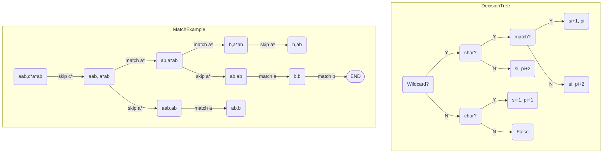

# Regular Expression Matching


<!--more-->

## Description
Given an input string (s) and a pattern (p), implement regular expression matching with support for '.' and '*'.

```
'.' Matches any single character.
'*' Matches zero or more of the preceding element.
The matching should cover the entire input string (not partial).
```

Note:
 - s could be empty and contains only lowercase letters a-z.
 - p could be empty and contains only lowercase letters a-z, and characters like . or *.

Example :
```
Input:
s = "aab"
p = "a*b"
Output: true
Explanation: "a*" does not match the entire string "aa".
```

## Backtracking Solution

We define `search(si, pi)` as the search function, which means if `s[si:]` is matched by `p[pi:]`.

First we need to check if `p[pi]` is a **wildcard**: `p[pi+1] == "*"`, and don't forget the corner case: `pi+1 < len(p)`
1. Not wildcard: Just check if `s[si]` and `p[pi]` is **same character**: `si < len(s) and s[si] == p[pi]`
    - If it is, search next level: `search(si+1, pi+1)`
    - If not, just return `False`, search ends here.
2. Wildcard: Same as step 1, check if it's the same character: 
    - If it is, that's a valid wildcard match. But we could still choose to match or skip this wildcard: `search(si+1, pi) or search(si, pi+2)`
    - If not, the only choice is to skip this wildcard: `search(si, pi+2)`

```python
class Solution:
    def isMatch(self, s: str, p: str) -> bool:
        def search(si: int, pi: int) -> bool:
            if pi == len(p): 
                return si == len(s)
            wildcard: bool = pi+1 < len(p) and p[pi+1] == "*"
            match: bool = si < len(s) and p[pi] in {s[si], "."}
            if wildcard:
                if match:
                    return search(si+1, pi) or search(si, pi+2)
                else:
                    return search(si, pi+2)
            else:
                if march:
                    search(si+1, pi+1)
                else:
                    return False
        return search(0, 0)
```
 
Some conditional branches could be merged by `and` operator.
  
```python
class Solution:
    def isMatch(self, s: str, p: str) -> bool:
        def search(si: int, pi: int) -> bool:
            if pi == len(p): 
                return si == len(s)
            wildcard: bool = pi+1 < len(p) and p[pi+1] == "*"
            match: bool = si < len(s) and p[pi] in {s[si], "."}
            if wildcard:
                return (match and search(si+1, pi)) or search(si, pi+2)
            else:
                return match and search(si+1, pi+1)
        return search(0, 0)
```

 - The code could be easily optimized using a cache to avoid duplicate calculation. See [Optimize Recursion]().
 - Always pay attention to corner cases in recursion. 
 - Below is an example for matching `aab` and `c*a*ab`, with the dicision tree of the backtracking search path.



## Dyamic Programming

First we can construct state transision from the backtracking method. Jut let `search(si, pi)` to be `dp[si][pi]`

```text
dp[si][pi] <--------------- dp[si][pi+2]
    ^      \
    |       \  
dp[si+1][pi] dp[si+1][pi+1]
```

 - We have a `(len(s) + 1, len(p) +1)` matrix, the iteration order is described below. 
 - Starting from `dp[len(s)][len(p)-1]`, we need to get `dp[0][0]`
 - Set `dp[len(s)][len(p)] = True`, which indicates our backtracking terminal condition(find a match).


|s\p|c|\*|a|\*|a|b||
|:-:|:-:|:-:|:-:|:-:|:-:|:-:|:-:|
|a|end||||||F|
|a|||||||F|
|b|||||||F|
|||||||start|T|

The core logic is pretty straightforward like backtracking solution:
```python
class Solution:
    def isMatch(self, s: str, p: str) -> bool:
        dp: List[List[bool]] = [[False]*(len(p)+1) for _ in range(len(s)+1)]
        dp[len(s)][len(p)] = True
        for si in range(len(s), -1, -1):
            for pi in range(len(p)-1, -1, -1):
                wildcard: bool = pi+1 < len(p) and p[pi+1] == "*"
                match: bool = si < len(s) and p[pi] in {s[si], "."}
                if wildcard:
                    dp[si][pi] = (match and dp[si+1][pi]) or dp[si][pi+2]
                else:
                    dp[si][pi] = match and dp[si+1][pi+1]
        return dp[0][0]
```

Notes:
1. This is similar to [Distinct Subsequences]()
